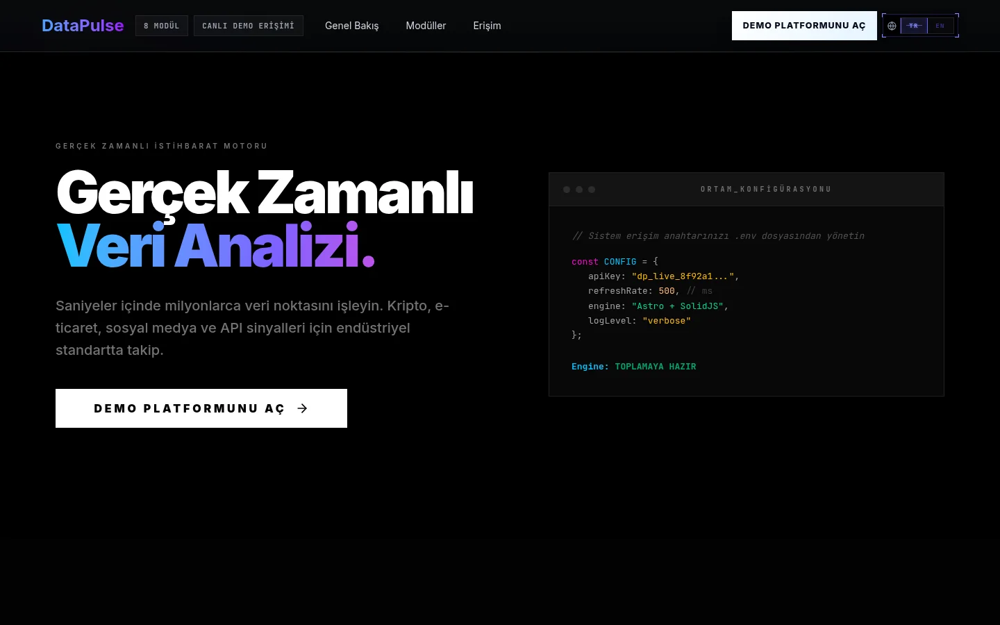
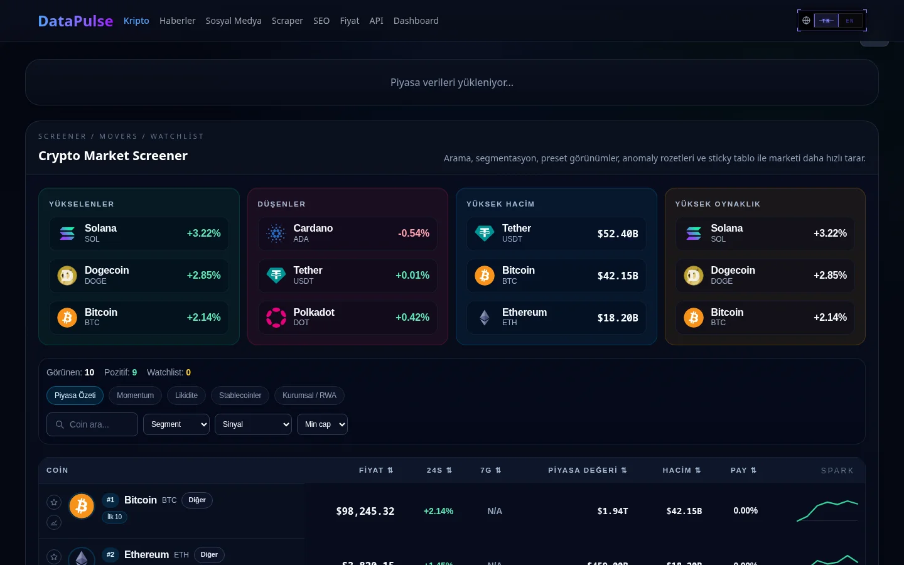
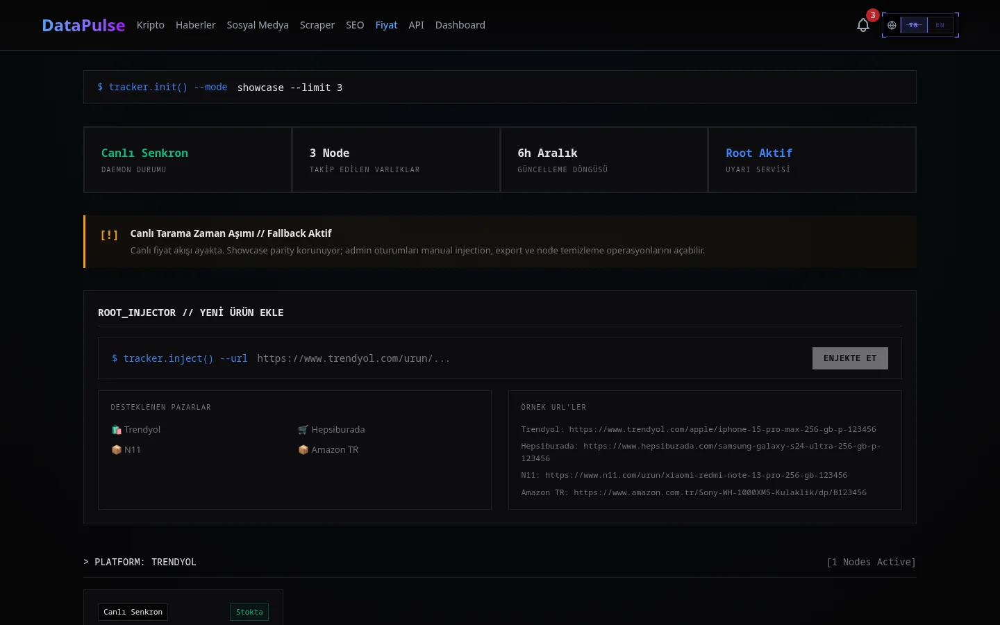
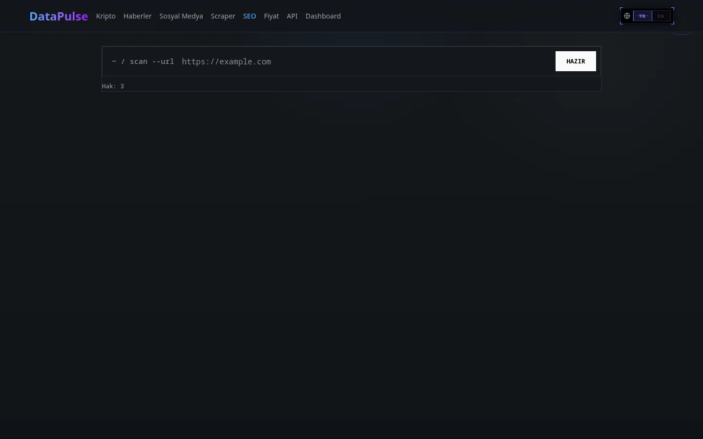
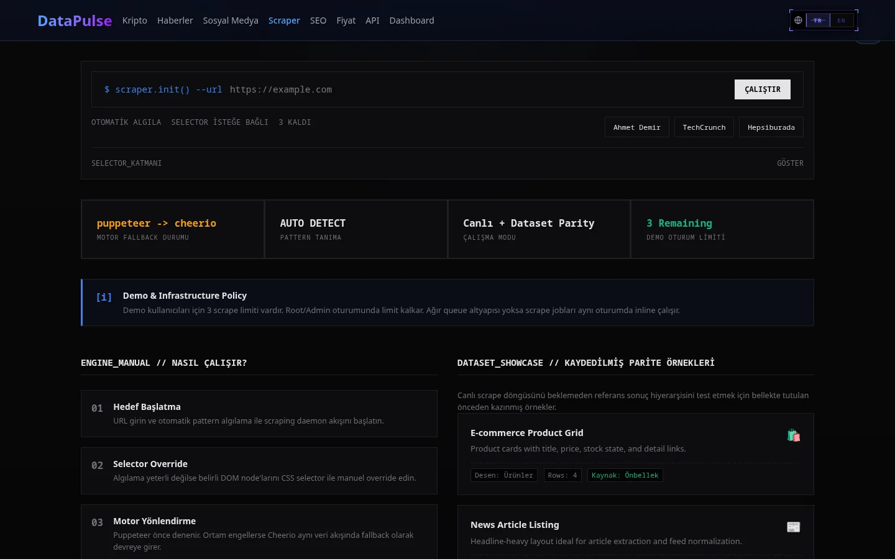
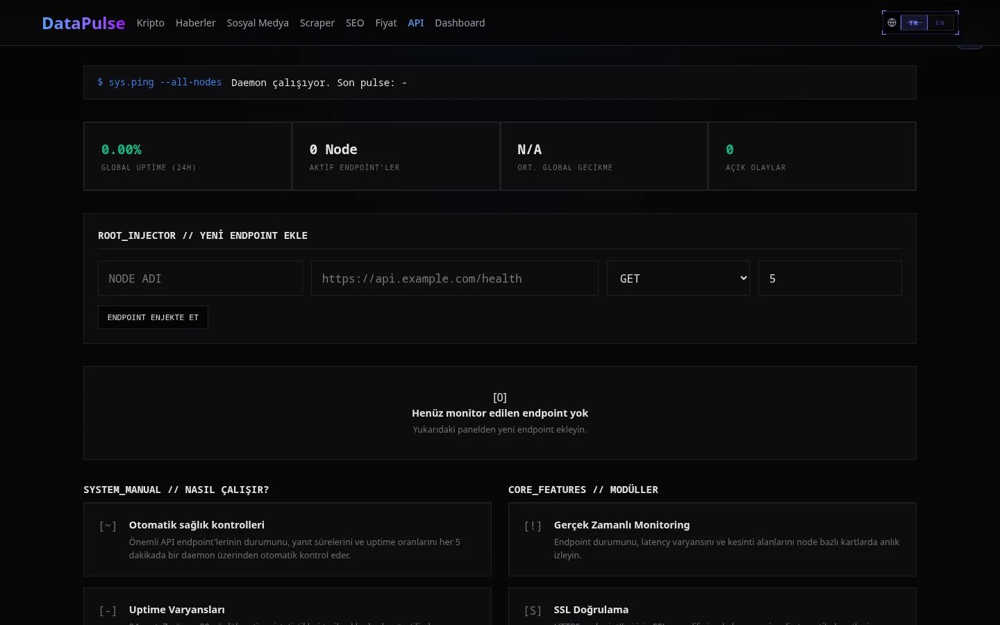
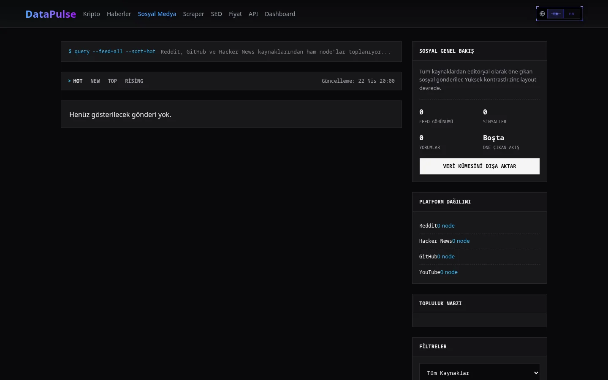
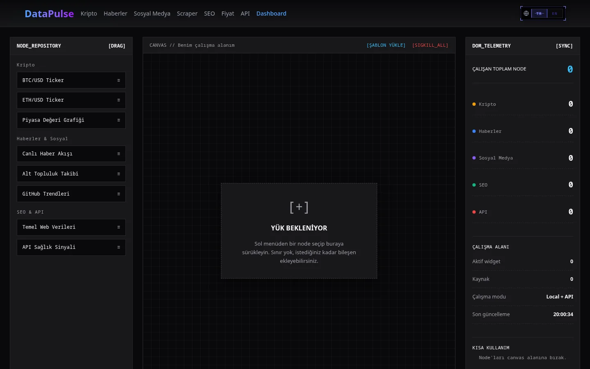

<div align="center">


# DataPulse

**Multi-stack intelligence hub** — kripto piyasası, haber akışı, sosyal medya trendleri, scraping, SEO analizi, fiyat takibi, API monitoring ve sürükle-bırak dashboard builder. Her bir alan kendi başına çalışan bir mini-modül; Astro shell'inde SolidJS island'lar olarak yaşar.

[](#mimari)
[](https://datapulse.lavescar.com.tr)
[](#license)

[**▸ Live demo**](https://datapulse.lavescar.com.tr) · [**▸ Portfolyo**](https://lavescar.com.tr) · [**▸ Diğer demolar**](https://lavescar.com.tr/#projects)

</div>

---

<p align="center"></p>

## Genel bakış

DataPulse, küçük takımların pazar/operasyon sinyallerini tek panelden izleyebilmesi için tasarlandı. Her modül bağımsız çalışır ama merkezi notification bus ve session yönetimini paylaşır. Astro 5 + SolidJS island stratejisi sayesinde başlangıç bundle'ı küçük, sayfa-spesifik etkileşimli alanlar lazy yüklenir.

İkili backend stratejisi ile gelir: Hono/Bun (mevcut canonical) + paralel Rust/Axum (read-heavy uçların kademeli göçü için). Production deploy'unda Cloudflare Pages (FE) + Google Cloud Run (BE) ayrımı önerilir.

## Modüller

| Modül | Açıklama |
|---|---|
| **Crypto** | Coin listesi, fiyat hareketleri, mum grafikleri |
| **News** | RSS + scraping kaynakları, kategori filtresi |
| **Social** | Trend topic'leri, mention sayacı, dönemsel volatilite |
| **Scraper** | Hedef URL → DOM extract → sonuç JSON; örnek senaryo galerisi |
| **SEO** | Sayfa analizi (meta, lighthouse-lite, broken link), job-based |
| **Price tracker** | Ürün URL'i → fiyat geçmişi + alarm, CSV export |
| **API monitor** | Endpoint health-check, status code, latency p95 |
| **Dashboard builder** | Sürükle-bırak widget şablonları, kullanıcıya özel layout |

## Mimari

```
┌─────────────────┐    HTTPS     ┌──────────────────┐
│   Astro 5 SSR   │─────────────▶│  Hono (Bun)      │
│   (frontend)    │   /api/*     │  REST + sessions │
│   SolidJS islands│              └────────┬─────────┘
└─────────────────┘                        │
                                  ┌────────┴────────┐
                                  │  Rust / Axum    │  ← read-heavy migration target
                                  │  (parallel)     │
                                  └─────────────────┘
```

| Katman | Teknoloji | Default port |
|---|---|---|
| Frontend | Astro 5 + SolidJS islands + TypeScript | `3031` |
| API (mevcut) | Hono on Bun | `8131` |
| API (Rust) | Axum | `8321` veya `8423` |
| DB | SQLite (`app/backend/data/datapulse.db`) |  |
| Cache/queue | Redis (opsiyonel) |  |
| Shared types | `app/shared` |  |

## Ekran görüntüleri

<table>
  <tr>
    <td></td>
    <td></td>
  </tr>
  <tr>
    <td></td>
    <td></td>
  </tr>
  <tr>
    <td></td>
    <td></td>
  </tr>
  <tr>
    <td colspan="2"></td>
  </tr>
</table>

## Hızlı başlangıç

```bash
git clone https://github.com/Lavescar-dev/datapulse.git
cd datapulse

bun install

# Tek komutla full stack (Astro + Hono)
bun run dev
```

Bağımsız komutlar:

```bash
bun run dev:frontend             # Astro     → :3031
bun run dev:backend              # Hono+Bun  → :8131
bun run dev:backend-rust         # Axum      → :8321
bun run dev:backend-rust:replace-hono   # Axum   → :8131 (Hono yerine)
```

## Rust backend (kademeli göç)

`app/backend-rust` Axum bootstrap, Hono'nun read-heavy uçlarını birebir karşılayan paralel implementasyon. Kapsama:

- `/health`, `/api/session/{start,status}`, `/api/admin/login`
- News, social, crypto, price, monitor, notifications
- Scraper: `submit`, `status/:jobId`, `result/:jobId`
- SEO: `analyze`, `status/:jobId`, `result/:jobId`
- Builder: `templates`, `dashboards/from-template`, `widgets/data`

Frontend'i Rust'a yönlendirmek için:

```bash
DATAPULSE_API_PROXY_TARGET=http://127.0.0.1:8423 \
DATAPULSE_API_BASE_URL=http://127.0.0.1:8423 \
bun run dev:frontend
```

Ya da Hono port'unu Rust ile değiştir:

```bash
bun run dev:backend-rust:replace-hono
```

## Production deploy

Önerilen split:

| Katman | Hosting |
|---|---|
| Frontend | Cloudflare Pages (`datapulse.your-domain.com`) |
| Backend | Google Cloud Run (`api.your-domain.com`) |

Production env:

- `PUBLIC_DATAPULSE_API_BASE_URL` — frontend'in browser-side base URL
- `CORS_ORIGINS` — backend'e izinli Pages domain'leri
- `COOKIE_SECURE=true` — production cookie flag

`bun run --smol` low-memory host'lar için faydalı.

## Komut referansı

```bash
# Mevcut canonical stack
bun run dev          # Astro + Hono
bun run build        # Astro static build
bun run preview      # build önizleme
bun run start:backend  # Hono production

# Legacy SvelteKit shell (sadece referans)
bun run legacy:dev
bun run legacy:build
```

## License

MIT © 2026 Lavescar

---

<sub>Built by **[Lavescar](https://lavescar.com.tr)** · [Portfolyo](https://lavescar.com.tr/#projects) · [efe@lavescar.com.tr](mailto:efe@lavescar.com.tr)</sub>
